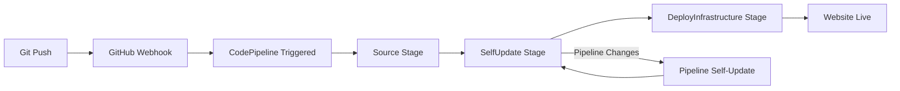

# AWS Resume Website with Self-Updating CI/CD Pipeline

A project to create a personal Resume website with **Self-Mutating Pipeline** - Pipeline automatically updates itself and deploys infrastructure through GitOps workflow.

## 🚀 Features

- **📄 Responsive Resume website** with modern design and dark mode  
- **🔄 Self-Updating Pipeline** automatically updates itself when changed
- **⚡ GitOps Workflow** - all infrastructure changes through Git
- **☁️ S3 Static Website Hosting** with high scalability
- **🔗 GitHub Integration** with automatic webhooks
- **📦 Infrastructure as Code** completely automated
- **🔒 AWS SSM Parameter Store** for GitHub token security
- **📊 JSON-driven content** easy Resume updates

## 🏗️ Architecture Pattern

**Self-Mutating Pipeline**: Pipeline treats itself as infrastructure that can be updated

```
Bootstrap (Manual 1x) → Self-Updating Pipeline → Infrastructure + Website (Auto)
                           ↑                           ↓
                        Git Push ←------------------→ Deploy
```

## 📁 Project Structure

```
aws-resume-cloudformation-cicd/
├── infra/
│   ├── bootstrap-pipeline.yaml    # Self-updating pipeline stack
│   ├── infrastructure.yaml        # Website infrastructure stack  
│   ├── parameters.json            # CloudFormation CLI parameters (ParameterKey/ParameterValue array)
│   └── pipeline-parameters.json   # CodePipeline SelfUpdate parameters (JSON object for Fn::GetParam)
├── app/
│   ├── index.html                 # Resume website HTML
│   ├── style.css                  # CSS with responsive design
│   └── resume.json                # Resume data in JSON format
├── bootstrap-deploy.sh            # Bootstrap deployment script (run 1x)
├── buildspec-infrastructure.yml   # Infrastructure deployment spec
└── README.md                      # Documentation
```

## 🛠️ AWS Resources Created

### Bootstrap Pipeline Stack (Deploy once)
- **CodePipeline** - Self-updating pipeline with 3 stages
- **CodeBuild Project** - Infrastructure deployment 
- **S3 Bucket** - Pipeline artifacts storage
- **IAM Roles** - Admin access for pipeline self-mutation

### Infrastructure Stack (Auto-deploy)  
- **S3 Bucket** - Static website hosting for Resume
- **S3 Bucket Policy** - Public read access
- **IAM Role** - Website deployment permissions
- **CodeBuild Project** - Website deployment

## 📋 Prerequisites

### AWS Prerequisites
- ✅ AWS CLI installed and configured
- ✅ AWS Account with AdminAccess permissions (for self-updating pipeline)  
- ✅ AWS Profile configured (recommended to use dedicated profile)

### GitHub Prerequisites  
- ✅ GitHub repository (can fork this repo)
- ✅ GitHub Personal Access Token with `repo` permissions

### Create GitHub Personal Access Token
1. Go to GitHub Settings → Developer settings → Personal access tokens
2. Click "Generate new token (classic)"  
3. Select scopes: `repo` (Full control of private repositories)
4. Copy token and **STORE IN SSM PARAMETER STORE** (don't hardcode)

## 🚀 Deployment Guide

### Step 1: Setup SSM Parameter for GitHub Token (REQUIRED)

```bash
# Store GitHub token securely in SSM
aws ssm put-parameter \
    --name "/github/pat/pipeline" \
    --value "ghp_your_github_personal_access_token" \
    --type "String" \
    --description "GitHub PAT for CodePipeline"
```

### Step 2: Prepare repository

```bash
# Clone or fork this repository
git clone https://github.com/YOUR_USERNAME/aws-resume-cloudformation-cicd.git
cd aws-resume-cloudformation-cicd
```

### Step 3: Configure parameters

Edit `infra/parameters.json` file (used by `bootstrap-deploy.sh` / CloudFormation CLI):

```json
[
  {
    "ParameterKey": "ProjectName",
    "ParameterValue": "resume-website"
  },
  {
    "ParameterKey": "GitHubRepoOwner", 
    "ParameterValue": "your-github-username"
  },
  {
    "ParameterKey": "GitHubRepoName",
    "ParameterValue": "aws-resume-cloudformation-cicd"
  },
  {
    "ParameterKey": "GitHubBranch",
    "ParameterValue": "main"
  }
]
```
**Note**: No GitHubToken in file - automatically retrieved from SSM!

### Step 4: Bootstrap Pipeline (once only)

```bash
# Make executable
chmod +x bootstrap-deploy.sh

# Deploy bootstrap pipeline  
./bootstrap-deploy.sh
```

**Bootstrap script will:**
1. ✅ Check AWS CLI and authentication
2. ✅ Verify SSM parameter `/github/pat/pipeline` exists
3. ✅ Deploy self-updating pipeline stack
4. ✅ Setup GitHub webhook automatically

### Step 5: GitOps Workflow - All changes via Git

```bash
# After bootstrap, all changes go through Git
git add .
git commit -m "Deploy infrastructure and website"
git push origin main
```

**Pipeline automatically runs:**
1. **Source Stage**: Pull code from GitHub  
2. **SelfUpdate Stage**: Pipeline updates itself if changed
3. **DeployInfrastructure Stage**: Deploy infrastructure + website

### Step 6: Customize your Resume

Edit `app/resume.json` file with your information:

```json
{
  "personalInfo": {
    "name": "Your Name",
    "title": "Your Job Title", 
    "email": "email@example.com",
    "phone": "+1 xxx xxx xxxx",
    "location": "City, Country",
    "linkedin": "https://linkedin.com/in/yourprofile",
    "github": "https://github.com/yourprofile",
    "website": "https://yourwebsite.com"
  },
  "summary": "Brief description about yourself...",
  "skills": {
    "Programming Languages": ["Python", "JavaScript", "Java"],
    "Cloud Platforms": ["AWS", "Azure", "GCP"]
  }
}
```

### Step 7: Deploy changes via GitOps

```bash
git add app/resume.json
git commit -m "Update my resume information"
git push origin main
```

**🎉 Pipeline automatically runs and updates website!**

## 🔧 Self-Updating Pipeline Workflow

### GitOps Cycle


### 3-Stage Pipeline Process

#### **Stage 1: Source**
- Pull latest code from GitHub repository
- Create source artifacts

#### **Stage 2: SelfUpdate (CloudFormation Action)**  
- Automatic check: has pipeline template changed?
- **If changed**: CloudFormation updates pipeline stack
- **If no changes**: Skip and continue

#### **Stage 3: DeployInfrastructure**
- Deploy `infrastructure.yaml` stack (S3, IAM)
- Sync `app/` files to S3 website bucket
- Set proper content-types and cache headers

### Self-Update Mechanism
- Pipeline uses **CloudFormation Action** (not CodeBuild)
- `StackName: !Ref 'AWS::StackName'` - pipeline references itself
- `TemplatePath: SourceOutput::infra/bootstrap-pipeline.yaml`
- Pipeline has **AdminAccess** to update itself

## 📊 Monitoring and Management

### CloudWatch Logs
- Infrastructure deploy logs: `/aws/codebuild/{project-name}-infrastructure-deploy`
- Monitor build process and troubleshoot issues

### CodePipeline Console  
- Real-time pipeline status and execution history
- Manual trigger capabilities if needed
- Self-update history tracking

### S3 Website Management
- Static hosting enabled with proper cache headers
- Public read access only for website files
- Automatic content-type detection

## 🛡️ Security Best Practices

- ✅ **GitHub token in SSM** - no hardcoding in source
- ✅ **IAM least privilege** for individual resources
- ✅ **Pipeline AdminAccess** only for self-mutation
- ✅ **S3 bucket** public read only for website files
- ✅ **No secrets** in Git repository
- ✅ **Encrypted parameters** in CloudFormation

## 🔧 Troubleshooting

### Pipeline fails at SelfUpdate stage
1. Check CloudFormation events for pipeline stack
2. Verify template syntax in `infra/bootstrap-pipeline.yaml`
3. Ensure pipeline has AdminAccess permissions

### Infrastructure deployment fails
1. Check logs: `/aws/codebuild/{project-name}-infrastructure-deploy`
2. Verify parameter values in `infra/parameters.json` and `infra/pipeline-parameters.json`
3. Check IAM permissions for infrastructure resources

### Website not loading
1. Verify S3 bucket policy for public read access
2. Check static website hosting enabled
3. Ensure files uploaded with correct content-type

### GitHub webhook issues
1. Check GitHub repository webhook settings
2. Verify SSM parameter `/github/pat/pipeline` has valid token
3. Test pipeline manual trigger from AWS Console

### SSM Parameter not found
```bash
# Verify parameter exists
aws ssm get-parameter --name "/github/pat/pipeline"

# Recreate if missing
aws ssm put-parameter \
    --name "/github/pat/pipeline" \
    --value "your-new-token" \
    --type "String" \
    --overwrite
```

## 💰 Cost Estimation (Monthly)

For low to medium traffic:
- **S3 Storage**: ~$0.50-1 (website files)
- **S3 Requests**: ~$0.25-0.50
- **CodeBuild**: ~$0.005/minute × number of builds
- **CodePipeline**: Free tier (1 pipeline free)
- **CloudWatch Logs**: ~$0.50
- **SSM Parameters**: Free tier

**Total estimate: $1-3/month** for personal website

## 🚀 Advanced Features

### Add Code Quality Stage
Edit `infra/bootstrap-pipeline.yaml` to add stage:

```yaml
- Name: CodeQuality
  Actions:
    - Name: LintAndTest
      ActionTypeId:
        Category: Build
        Owner: AWS
        Provider: CodeBuild
```

Git push → Pipeline auto-updates with new stage!

### Environment-specific Deployments
- Create branches: `dev`, `staging`, `prod` 
- Each branch triggers separate pipeline
- Different parameter sets for each environment

### Custom Domain with CloudFront
```bash
# Add to infrastructure.yaml
CloudFrontDistribution:
  Type: AWS::CloudFront::Distribution
  Properties:
    DistributionConfig:
      Origins:
        - DomainName: !GetAtt ResumeBucket.DomainName
```

## 📈 GitOps Best Practices

### Feature Development
```bash
# Create feature branch
git checkout -b feature/new-section
# Make changes
git commit -m "Add projects section"  
git push origin feature/new-section
# Create PR → merge to main → auto-deploy
```

### Infrastructure Changes
```bash
# Modify infra/bootstrap-pipeline.yaml or infra/infrastructure.yaml
git commit -m "Add CloudFront distribution"
git push → Pipeline self-updates → Deploy changes
```

### Rollback Strategy
```bash
# Revert to previous commit
git revert HEAD
git push → Automatic rollback deploy
```

## 📚 Learning Resources

### AWS Documentation
- [CodePipeline User Guide](https://docs.aws.amazon.com/codepipeline/)
- [CloudFormation Self-Updating Stacks](https://aws.amazon.com/blogs/devops/)
- [S3 Static Website Hosting](https://docs.aws.amazon.com/s3/latest/userguide/WebsiteHosting.html)

### GitOps Best Practices
- [GitOps Principles](https://www.gitops.tech/)
- [Infrastructure as Code](https://docs.aws.amazon.com/whitepapers/latest/introduction-devops-aws/infrastructure-as-code.html)

## 📝 Changelog

### Version 2.0.0 - Self-Mutating Pipeline
- ✅ **BREAKING**: Redesigned architecture with self-updating pipeline
- ✅ GitOps workflow - tất cả changes qua Git
- ✅ CloudFormation Action cho self-update (thay vì CodeBuild)
- ✅ SSM Parameter Store cho GitHub token security
- ✅ Bootstrap deployment script
- ✅ Simplified 2-stack architecture
- ✅ AdminAccess permissions cho pipeline self-mutation
- ✅ Removed nested stacks complexity

### Version 1.0.0 - Initial Release  
- ✅ Basic nested stacks CI/CD pipeline
- ✅ S3 static hosting
- ✅ JSON-driven content
- ✅ Responsive design
- ✅ Dark mode support

## 📄 License

MIT License - xem [LICENSE](LICENSE) file để biết chi tiết.

## 📞 Hỗ trợ

Nếu gặp vấn đề:
1. 📖 Đọc phần Troubleshooting ở trên
2. 🔍 Check CloudWatch Logs cho detailed error messages
3. 🐛 Tạo GitHub issue với error logs và steps to reproduce
4. 💬 Discussion tab cho questions về architecture

---

## 🎯 Quick Start Summary

```bash
# 1. Setup GitHub token trong SSM
aws ssm put-parameter --name "/github/pat/pipeline" --value "your-token" --type "String"

# 2. Update infra/parameters.json and infra/pipeline-parameters.json
# 3. Bootstrap pipeline (1 lần duy nhất)
./bootstrap-deploy.sh

# 4. Mọi thay đổi sau đó qua Git
git add .
git commit -m "Update something"
git push  # → Automatic deployment!
```

**🚀 GitOps Pipeline:** Bootstrap once → Git push → Auto deploy → Self-updating → Profit! 

**⚠️ Security Notes**: 
- **NEVER** commit GitHub tokens vào Git
- Use SSM Parameter Store cho secrets
- Pipeline cần AdminAccess cho self-updating capability
- Regular rotation của GitHub tokens được khuyến nghị